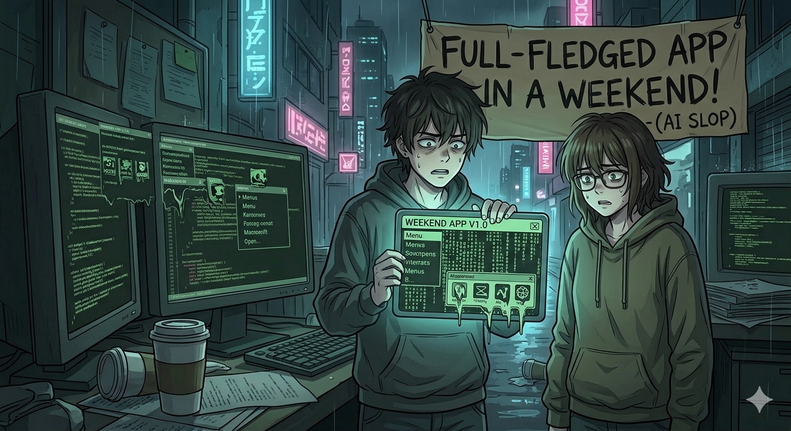
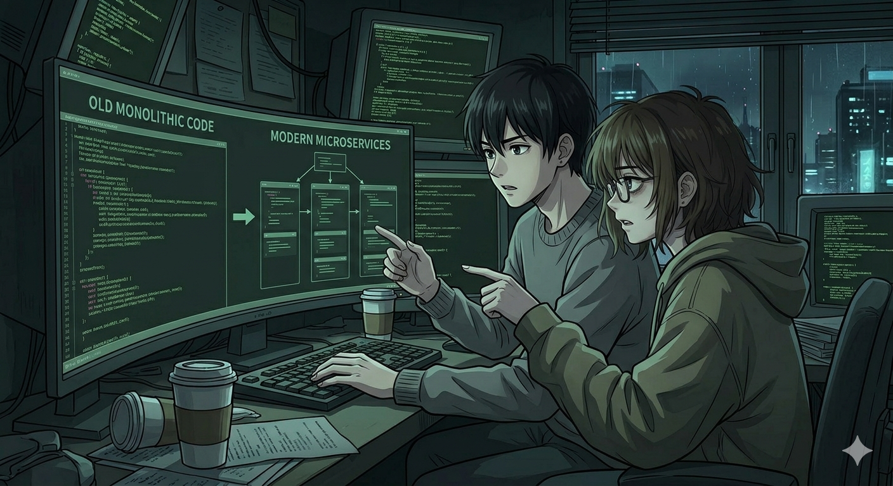

## Prologue

Picture the launch tweet: "Built this in a weekend with AI." Clean repo. No inherited dependencies. No pager. Just a greenfield sprint and a dopamine-rich deadline.

That story is real, but it is not the center of software engineering.

The larger reality is quieter. It's a Slack message at 9 AM: "payments are behaving weird, can you look?" It's inheriting a codebase where the person who wrote the critical scheduling module left eighteen months ago, the documentation is stale, and the test suite takes forty minutes to run when it runs at all. It's being asked to change something load-bearing without breaking the thing already making money.

This is maintenance. And by a wide margin, it is what software engineering actually is.

[Barry Boehm](https://en.wikipedia.org/wiki/Barry_Boehm) documented decades ago that maintenance consumes a large share of software lifecycle cost. Dave Farley makes the same point in [*Modern Software Engineering*](https://modernsoftwareengineering.co.uk/): maintenance is not a failure mode, it is the dominant mode for systems that survive. Developers also spend more time reading code than writing it, a pattern the [Stack Overflow Developer Survey](https://survey.stackoverflow.co/) keeps pointing toward. The hard part is rarely writing something new. The hard part is understanding what already exists well enough to change it safely.

That is where agentic workflows matter. The real opportunity is not just faster greenfield output. It is expanding what is practical when you're working in inherited, production code that cannot afford casual mistakes.

## The Five Scenarios

### 1. Code Understanding & Navigation

There is a particular pressure in being handed a large, unfamiliar codebase and a concrete deliverable: a roadmap, an architecture review, an uplift plan that leadership will actually use. You need to understand enough of the system to say something true, in writing, on a deadline.

The traditional workflow is slow for two reasons. First, reading and tracing the code takes time. Second, the people who understand the system best are usually hard to get on the calendar. You piece together understanding across files, tests, half-implicit conventions, and scattered conversations, hoping the picture is accurate enough to act on.

I ran into this while producing an uplift plan for a production system. The bottleneck was not the code reading. It was the coordination cost of pulling synchronous context out of busy engineers.

The agentic version changes the shape of the work. I can give Claude Code a rough intent statement such as: "I need to understand this codebase well enough to identify the highest-risk areas and draft an uplift plan." It turns that into a structured exploration, reads the repo, follows dependencies, notes what has test coverage and what does not, and produces a draft artifact that is often most of the way there.

That matters less because it is faster and more because it changes the ask. Instead of "can you walk me through this system?" the question becomes "here is my draft; what is wrong or missing?" Busy engineers can respond asynchronously. They are reviewing and correcting your understanding rather than generating it from scratch.

The limitation is equally important: agents can surface what the code does, but not why past decisions were made. Tradeoffs, constraints, and institutional memory do not fully live in the repository. You still need humans for that. The difference is that you reach them with sharper questions.

### 2. Refactoring & Modernisation

Refactoring legacy code has a different emotional profile from greenfield work. You are moving load-bearing walls in a house people are already living in. Unknown dependencies surface late. Side effects travel through call chains nobody has traced in years. If something breaks, it is yours.

One useful pattern here is chaining agent work rather than treating each interaction in isolation. After an initial codebase analysis, I wrote my own rough scratchpad for a modernisation plan: what I would prioritise, what I was unsure about, what direction seemed right. That human judgment, paired with the agent's repo-grounded analysis, produced a plan that was specific to the system rather than generic best practice dressed up as advice.

The second story is even more practical. I needed to move a .NET solution from version 8 to version 10. That kind of upgrade is necessary and useful, but mostly mechanical: update the framework, resolve deprecations and dependency issues, run the tests, verify nothing broke.

Because we had a thorough test suite, I could delegate it: create a branch, upgrade to .NET 10, and make sure all tests pass. Then I let it run while I spent my attention elsewhere.

That is the real guardrail. A good test suite turns the agent from a risk into a useful workhorse. Without tests, you have no reliable feedback loop. With them, you can safely delegate more of the mechanical transformation.

The limitation is that passing tests are still not a guarantee. Runtime upgrades can behave differently under load, in infrastructure-specific conditions, or in edge cases the suite does not cover. The output is a strong signal, not proof. The deployment judgment is still yours.

### 3. Debugging & Incident Response

The phone buzzes before full comprehension arrives. P1. Payments, auth, a core service, it hardly matters which. Slack is already moving. You are orienting yourself in a part of the system you do not own well while also fielding questions from everyone who wants an ETA.

Those two jobs compete directly: find the problem, and keep enough people updated that they stop interrupting you so you can find the problem.

The traditional workflow is brutal under pressure. You read logs, trace unfamiliar call chains, reconstruct a timeline from artifacts that were never designed to tell one, and make probabilistic guesses about which path the system actually took. Every wrong hypothesis costs time you do not have.

This is where agents can materially expand your search surface. In incidents touching unfamiliar areas, I have used an agent with access to git history and relevant logs to generate candidate explanations quickly. Where I might inspect twenty files, it can inspect hundreds. Where I would manually piece together recent changes, it can trace the error signature through commits and highlight what changed in the affected area.

The useful output is not "the answer." It is a narrowed set of plausible hypotheses worth testing.

That is why the centaur model fits. The human contributes judgment, prioritisation, and communication. The agent contributes breadth, speed, and the ability to hold multiple candidate paths in parallel. Neither is sufficient alone.

Two limitations matter here. First, agents are weaker where the code is weaker: niche stacks, bespoke frameworks, and poorly documented internal abstractions reduce signal quality fast. Second, the prompting discipline matters. Do not ask for the root cause as though the first answer is final. Ask for possible causes, ask for justification, then test and eliminate. The agent is a hypothesis engine. You are still the one running the loop.

### 4. Test Coverage & Safety Nets

There is a quieter kind of fear in legacy code with no tests: not the fear of immediate outage, but the steady uncertainty that you may have broken something and have no way to know. Over time, engineers stop touching certain files not because they cannot change them, but because they cannot validate the change with confidence.

"Add tests" is correct advice, but it is incomplete. Writing useful tests for inherited code is slow because it requires understanding the code well enough to tell what it should do, not just what it currently does. That work is difficult to schedule, so it slips.

One thing that changed my workflow was adopting agent constitution files such as CLAUDE.md and AGENTS.md. The value is simple: the repository can define standing rules for how the agent works.

The first rule I want encoded is the definition of done. Any change must include appropriate test coverage, and all tests must pass before the task is considered complete. That expectation should not depend on whether I remembered to restate it in the prompt.

On top of that, I use layered review passes: one delegated review focused on correctness, security, and maintainability, then a PR-level review on top. Neither replaces human judgment, but both raise the floor.

The next step I find promising is asking an agent to generate an incremental test coverage plan for a legacy system. Not total coverage. Prioritised coverage. Start with money flows, auth paths, and the places where subtle regressions are expensive.

The limitation is structural and easy to miss. Agent-generated tests capture current behaviour, including bugs. If the code returns the wrong answer, the agent may faithfully write a test asserting that wrong answer. **The agent can tell you how the code behaves; it cannot tell you how the code should behave.** That still requires human understanding.

### 5. Tech Debt Payoff

Once you develop a realistic mental model of an agent, the conversation around technical debt changes. It stops being a novelty and starts being a collaborator with a specific profile: useful for idea expansion, strong at mechanical refactoring, poor at deciding what matters without guidance. Once you know what to delegate and what to keep, some of the work sitting in the "someday" bucket starts to feel tractable.

I had a handler method over 700 lines long. Not because of one spectacular mistake, but because years of reasonable-seeming additions had accumulated in one place. Every time I opened it, it radiated the same question: do you dare touch me?

What changed was not sudden courage. It was the existence of a safety net. With standing test requirements encoded in the agent constitution, I no longer had to build the guardrail from scratch before delegating. I could define the task precisely: break this handler into focused methods, each with a single responsibility, each under 20 lines, and do not call it done unless the tests pass.

So I gave the spec to the agent between meetings. Later, during a lull, I checked back: done, tests passing. I reviewed the changes, raised the PR, and a task that had sat in the background for months was finally off the board.

This works when two conditions hold: the task is well-defined, and the safety net exists. Those are not minor details. They are the entire architecture. Vague asks produce vague outcomes. Precise asks plus reliable feedback produce useful delegation.

The same tools apply to bigger debt, including the god class. The difficulty is not that the pattern changes. It is that the discipline has to scale with the complexity.

## The Tools

Across these scenarios, I keep using three modes.

Claude in chat is for exploratory reasoning. It is useful when I am still forming a mental model and want to think across multiple files, pasted snippets, and possible interpretations.

Claude Code is for repo-aware execution. It can navigate the repository directly, trace dependencies, propose changes in place, and read the constitution file at the start of each session. That last part matters because it lets standards such as testing expectations and definition of done persist across tasks.

Background agents are for well-defined multi-step workflows I do not need to supervise moment by moment: upgrade the runtime, run the tests, report back. They save time only when the task definition is precise enough that the result is easy to verify.

These tools do not replace understanding. They amplify the understanding the engineer brings.

## When Agentic Workflows Win (and When They Don't)

Agents are strongest when the relevant knowledge is in the code. They are good at broad repo traversal, repetitive mechanical change, and compressing the orientation phase in unfamiliar systems.

They are weaker when the missing context lives outside the repository: business intent, historical constraints, internal politics, unwritten contracts, and bespoke systems with little external documentation.

The sharpest failure mode is vague delegation. "Improve this class" is aesthetic. "Refactor this into focused methods, each under 20 lines, all tests must pass" is verifiable. That gap is the difference between useful delegation and a coin flip.

There is also the trust question. Agent-written changes in production code need review, sometimes more rigorously than human-written changes, because agents can be confidently wrong in ways that look plausible.

The heuristic I keep coming back to is simple: if you could explain the task clearly to a capable engineer new to the domain, an agent will probably help. If the missing knowledge is not in the code or the conversation, you still need to lead.

## Epilogue

AI-assisted development is changing what is practical, but the loudest stories still over-index on greenfield work.

The more interesting story is what happens in inherited systems: the ones already serving users, already making money, already too load-bearing to treat casually. That is where many engineers actually live.

That is who this series is for.

In the next part, I'll go deep on the first scenario: Code Understanding and Navigation. Real codebase, real workflow, and the places the agent is useful, misleading, and worth challenging.

Happy Coding!

PS: Feel free to reach out via LinkedIn.

## References

1. [ThoughtWorks: Using GenAI to Understand Legacy Codebases](https://www.thoughtworks.com/radar/techniques/summary/using-genai-to-understand-legacy-codebases)
2. [ThoughtWorks: Curated Shared Instructions for Software Teams](https://www.thoughtworks.com/radar/techniques/summary/curated-shared-instructions-for-software-teams)
3. [Barry Boehm, *Software Engineering Economics*, 1981](https://archive.org/details/softwareengineer0000boehm)
4. [Dave Farley, *Modern Software Engineering*, 2023](https://modernsoftwareengineering.co.uk/)
5. [Stack Overflow Developer Survey](https://survey.stackoverflow.co/)
