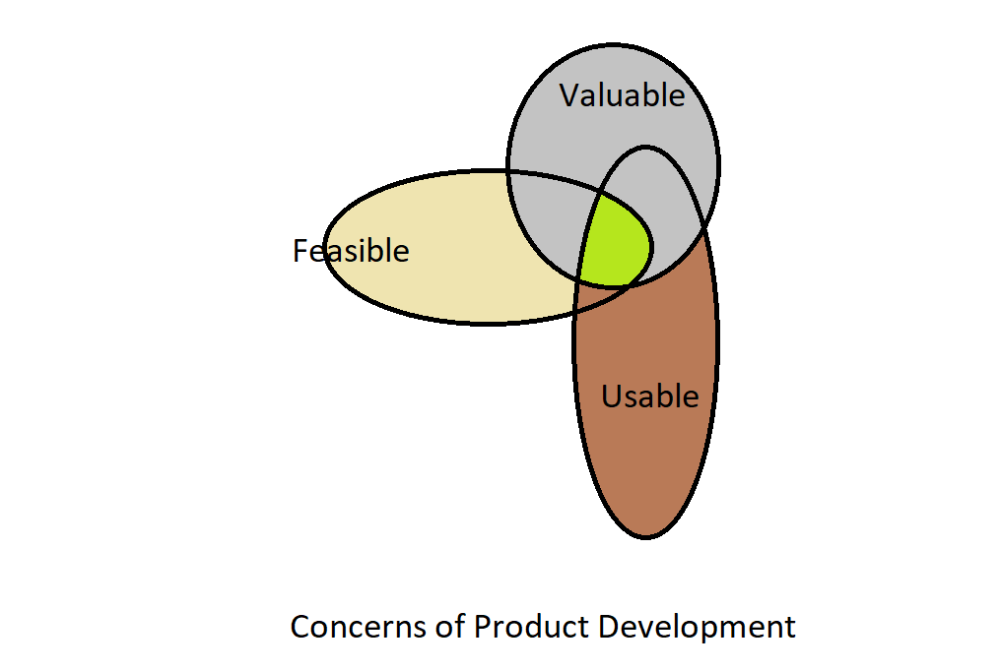

---

title: Notes from Jeff Patton's talk - Requirements, Product Ownership and Agile Development
description: A transcript and my notes from Jeff Patton's talk on Requirements, Product Ownership and other misunderstood concepts in Agile Development
date: 2017-10-29
tags: 
- Agile
- development-methodologies
- agilists
---

## Prologue 
One of these days I was watching a great talk by [Jeff Patton](http://jpattonassociates.com/), one of the Agile luminaries I follow to learn about agility and vet my own ideas and musings. The talk can be found on [Vimeo here](https://vimeo.com/128605832). The talk is from two years ago but the thoughts resonate as strongly as ever. Now that I have had the good fortune of being around some great minds by virtue of my tenure in [Readify](https://readify.net), a lot of his points resonate even stronger. In this post, I have attempted to highlight the most pertinent thoughts Jeff talks about and tried to add my own 2 cents from my experience in the field. The quoted text is my reflection on an idea/thought in the video.

## 1. Building software isn't the point

> What makes me happy and keeps me going is the love of helping people.
> That it is through building great software is a happy accident
 
 *Central idea:* "Requirements" are essentially people's ideas to help people. Software is eventually meant to change the world for its users. E.g. an online transport ticketing system makes the lives of commuters easy and stress free.
  
- Between an idea and the delivered software lies **Output** measured by **Velocity**
- Delivered software produces an **Outcome** - measured in terms of behaviour (of users)
- The long term effect of the delivered software is its **Impact**

 > The key principle of agile development is to minimize the distance between an idea and a delivery, so that the outcome can be measured faster and impact can be maximised. 
 
 In Jeff's words: Agile development is all about maximising outcome and impact (or business value) and minimizing output (i.e. the distance between an idea and the realised software)
 
 Jeff also mentions that Kent Beck objected to the word requirement as it has the connotations of permanence and absolutism - Agility on the other hand is about embracing change so the language and artifacts should reflect that spirit of openness to change. 
  
## 2. The best requirements aren't written down
The [Cake wrecks site](https://www.cakewrecks.com/) is mentioned as an example of when writing alone does not convey all the meaning. E.g. A cake that read "Nuts Allegy Happy Birtday David" - when the customer merely wanted to indicate that the consumers of the cake have nuts allergy and the cake should have Happy Birtday written on it!
 
 In Kent Beck's words, "Stop exchanging documents, tell me your story"
 The idea is to generate energy, interest and vision in the listener's mind about what the software does. It's the job of both the user and the developer to figure out what needs to be built. 
 > The story is the starting point of converstaions between a user and developer. It is a medium of communication, a means to an end - the end being working software, on time and within budget.
 
 When we combine the energies of a user and developer and refine a story, we arrive at something better. Jeff goes on to mention an exercise where participants are given portions of a picture with three coloured figures. Each of them has read a requirements document but understood the contents differently. One sees a square, the other a circle and the thrid one a triangle. When they externalise their thoughts, they realise that difference in understanding. They refine and combine until all of them realise that they all arrive at a star like shape. This point forward, they actually mean the same thing when they talk about the thing being built.
 So, to summarise a Story driven communication:
 - Starts with shared understanding
 - Spreads shared understanding with discussion
 - Builds software equipped with shared understanding

 
## 3. You just can't talk about what to build

> The typical "User Story template": As a xxx I want xxx So that xxx is a great place to start. 
> It isn't the only way to write or have conversations around **Who, What and Why** of the stuff getting built

The questions to ask and answer then are:
 - Who are the users and what benefits do they get?
   - Discuss multiple personas
   - Discuss stakeholders and others who don't directly use the software
   - Discuss elements of the system or services
 - What will users do with the features/changes being developed
 - Why should we build this software
 - Why would the organization benefit by developing this software?
  
## 4. It won't all fit on a card

Consider the following flow/sequence:
```
Card --> Conversation --> Confirmation --> Construction --> Consequences 
```

What that sequence represents is that a story card is the means to start a conversation, followed by confirmation from the parties involved which then triggers construction of the software and produces consequences.

> A story card is comparable to a library card - it is only the index of where to find the book
> The title of the story should be descriptive of the work being done 
Metadata captured on a story card is equally important:
- Estimated dev time
- Estimated value
- Dependencies
- Status of the work being done
 
Acceptance criteria defined on the story is of prime importance too in order to accept the story as "Done". As such, acceptance criteria:
- Needs to be clearly captured
- Must clearly define tests to verify that the acceptance criteria are met
- Should answer: How will we demonstrate the story at the review?
- Should discuss outcomes expected and how to measure them after the software is delivered
- Attach UI Sketches, technical details as applicable
 
As stated earlier, a story is expected to facilitate shared understanding but at the end of the day, it is only a means to an end. The team must:
- Plan to learn something from everything being built
- Budget time for documenting and internalizing the learning
 
## 5. There's no correct size for a story

At my current gig, we have gone through several cycles of trying to define a right-sized story: One that delivers business value whilst still being able to be completed in a sprint. I'm sure the reader would have come across terms such as "vertical slicing" or "horizontal slicing" as amateur ways of breaking down a story. In a gist:

- What is usually termed as an Epic needs discussion as it is too big and should be broken down into smaller stories
- Themes help group related stories together. These themes can be defined as "Sprint Goals"

When it comes to the size of a story,
- There's right sized for business
- There's right sized for users and customers (so they see the value being delivered)
- There is right sized for development - usually something that takes 1 to 3 days to build

Jeff says though that a story is a story - its the conversation around What, Who and Why that is really important. At my current gig, we are currently experimenting with an approach called S.P.I.D.R. to break down stories. A blog post on how that goes is definitely in the works :-)

## 6. Breaking down stories too soon is a bad idea

*The Key Idea*: Use conversation and collaboration to break down stories just in time. Usually when the What and Why have been figured out and a shared understanding has been established.

Throwing away stuff that won't be done is as important, if not more than what will be built. That is, "Maximise the outcome with a minimised output". Often times, a Story Workshop may be required which is described as 3 to 5 people whiteboarding the "how" of a story.

> From my own experience, focused discussions on how we'd build something before the team gets together for a refinement, takes the strain out of refinement. Especially, details such as how much would it cost, what should the acceptance criteria be and should the story be worked upon in pairs (i.e. pair programmed). A well groomed backlog then refers to the idea of stories having the right titles to begin the right conversations.
   
## 7. It's a bad idea for the product owner to make all the decisions

The idea of a single person adding items to the backlog is flawed. Jeff tells the story of Marty Cagan and references the book [Inspired](https://www.goodreads.com/book/show/3323374-inspired) by Marty. Marty was one of the first product managers in Netscape. 


The book describes a triad - a group that together covers all of the concerns depicted above and should really be the product ownership - a sweet spot of the three circles of Valuable, Usable, Feasible as shown in the diagram.
   
> The product owner provides leadership, not necessarily central decision making. The whole team needs the shared understanding for building the right thing. Product Owners lead small discovery teams to focus on Valuable, Usable and Feasible solutions.
   
## 8. Backlogs don't help you (or your team) understand your product

Often, it is assumed that looking at the product backlog is enough for anyone in the team to get the "big picture" of where things are headed. In reality, you need a backbone, a theme, a structure to see where you're going. What is needed is some kind of roadmap so that conversations could have some context of the big picture. Jeff recommends to use *story mapping* to help understand that bigger picture.
  
## 9. You're likely building the wrong thing
The term "MVP product", popularised by the book "The Lean Startup" has become cliched and overused. It is poorly understood, if understood at all and it is often ambiguous as to what an MVP looks like. 
An MVP must be tied to an outcome. To restate an excerpt from the beginning of this post, an outcome is what happens when the desired software is delivered. The outcome needs to be measured to decide what to do next, whether to correct the course, continue or abandon. At the end of the day, use validated learning and experiments to learn if the right thing is getting built.
   
## 10. You're estimates won't be accurate
During the Professional Scrum Master course, my trainer asked us a question: How accurate is your estimate? People attending the class delved into various methodologies of estimating such as Function points, but in the end it became abundantly clear that all estimates are eventually wrong. That may seem like a string statement to make but consider this: let's say you are told that a scrum team has a velocity of 30 points at best and 20 at worst; the current backlog for a new feature is 120 points. When exactly will the feature be delivered? No matter how you try to answer that question, chances are, you'd be off. The only way is to build up iteratively and incrementally for highest possible quality on time. 

Hope this helps drive conversations towards improving the practices of your team. 
