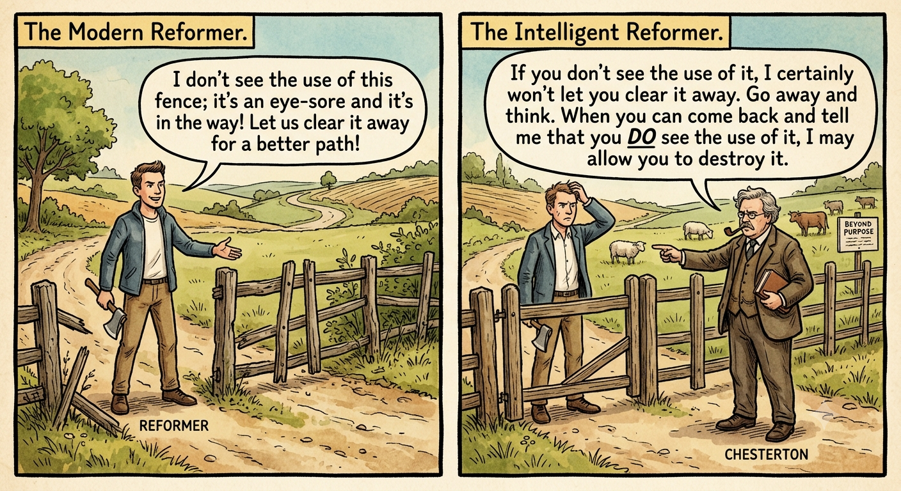
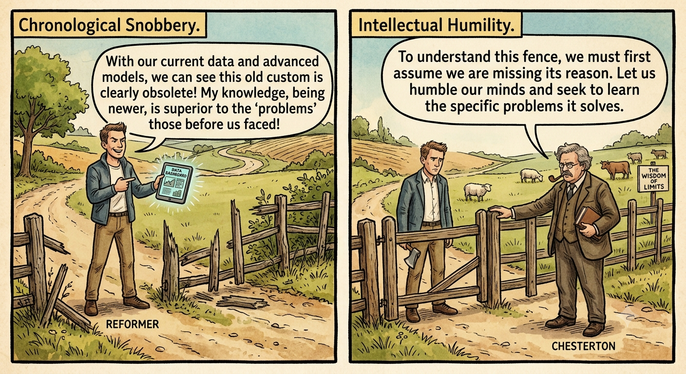
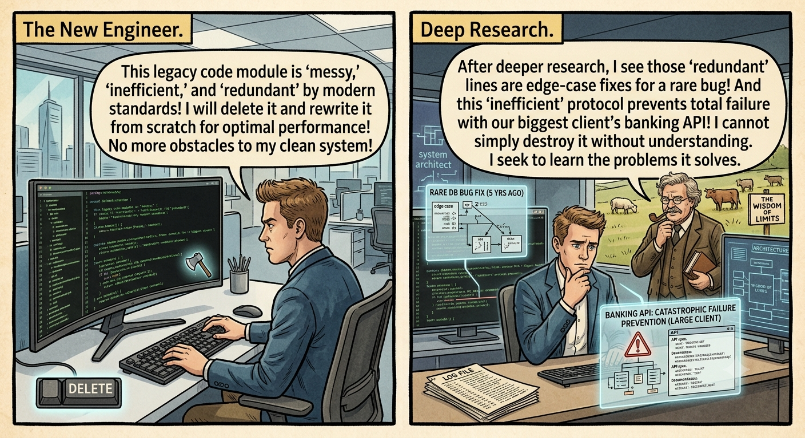

### The Wisdom of the Barrier: Understanding Chesterton’s Fence

In our fast-paced modern world, the urge to "disrupt" and "innovate" often feels like a moral imperative. We see a process that seems slow, a tradition that looks outdated, or a literal barrier that appears to serve no purpose, and our first instinct is to tear it down. However, the 20th-century English writer G.K. Chesterton proposed a vital counter-philosophy that remains one of the most important mental models for clear thinking today. This principle, now famously known as **Chesterton’s Fence**, suggests a simple but profound rule: never knock down a fence until you understand why it was put up in the first place.

#### The Origin of the Fence

The concept originates from a clever paradox Chesterton described regarding the nature of reform. Imagine you are walking through the countryside and encounter a fence or a gate stretching across the road. To your eyes, it is a low, wooden, rickety structure that seems to serve no immediate purpose. It is an eyesore and a hindrance to your journey.

A "modern type of reformer" might look at this fence and say, "I don’t see the use of this; let us clear it away". They believe that by removing the obstacle, they are performing a "good Samaritan" act that will make the path easier for all future travelers. But Chesterton argues that an "intelligent type of reformer" would respond differently: "If you don’t see the use of it, I certainly won't let you clear it away. Go away and think. Then, when you can come back and tell me that you **do** see the use of it, I may allow you to destroy it".

The core idea is that fences are rarely built by accident or for the sake of being annoying. The fence likely serves a specific function that isn't immediately obvious to a casual observer. Perhaps it separates cattle from sheep, or it prevents local animals from wandering into a patch of poisonous plants. Unless you know exactly what the fence does or why it exists, leaving it alone is the only rational course of action.

#### Why We Rush to Tear Things Down

The impulse to dismantle "useless" things often stems from what is called [**chronological snobbery**](https://en.wikipedia.org/wiki/Chronological_snobbery). This is the arrogant assumption that because we live in the present and have access to modern technology and data, our knowledge is intrinsically superior to that of those who came before us. When we encounter a societal custom, a tradition, or a corporate policy that seems flawed or archaic, we often fail to recognise that these "fences" usually arose as solutions to specific problems.

By ignoring this reality, we risk creating **unintended and potentially negative consequences**. If we remove things without first understanding their underlying function, we are likely to accidentally recreate the very problems the fence was designed to prevent. As the visionary CEO Astro Teller has noted, we should ask ourselves what we could do to "break" a thing, even when everyone else thinks we are crazy, to truly understand its structural necessity.

True wisdom requires **intellectual humility**. It means starting from a place of assuming that if a structure or tradition exists, it is probably because you are missing something important. It is an acknowledgment that your own knowledge has limits.

#### Applying the Fence to the Technology Sector

While Chesterton’s analogy focused on the countryside, the principle is arguably more relevant today in the high-stakes world of **technology companies**. In a tech environment, "fences" often take the form of **legacy code**, obscure internal processes, or long-standing security protocols that seem to slow down development.

Imagine a newly hired lead engineer at a fast-growing software startup. They look at a specific module of legacy code that appears "messy," "inefficient," and "redundant" by modern standards. It doesn't follow the latest architectural patterns, and it seems to be an obstacle to the "clean" system the engineer wants to build. The instinctual "modern reformer" move is to delete the code and rewrite it from scratch to improve performance.

However, applying Chesterton’s Fence would require the engineer to stop and investigate **why** that messy code exists. Upon deeper research, they might discover that those "redundant" lines are actually a series of "edge-case" fixes for a rare database bug that occurred five years ago. Or perhaps that "inefficient" protocol is the only thing preventing a catastrophic failure when the system interacts with a specific, outdated banking API used by the company’s largest client. 

By first understanding the "why" behind the messy code, the engineer can ensure that their new solution still fulfills those core protective purposes. Without this step, the "improvement" might launch successfully, only to cause a massive system outage weeks later when that rare edge case finally resurfaces. In the tech world, the "rickety fence" is often the only thing standing between a smooth operation and a total system collapse.

#### The Path to Mindful Progress

It is important to note that Chesterton’s Fence is not an argument for **stagnation**. The goal is not to keep every fence up forever regardless of its condition. Instead, it is an argument for **mindful reform**. 

We can and should upgrade our systems, renovate our traditions, and replace our old fences with better alternatives. However, progress arises from building upon the past, not by turning our backs on it. We can only truly "upgrade" a system when we comprehend the essential needs it was designed to meet. If we dismantle a barrier thoughtlessly, we often leave people feeling threatened rather than liberated.

The next time you encounter an outdated tradition in your community or a "pointless" policy at your job, pause and compassionately ask why it first arose before demanding its demolition. By making an earnest effort to grasp the "why," you display the self-awareness and maturity required to be a truly intelligent reformer. What fences in your life or work could benefit from a bit of kinder, wiser questioning today?