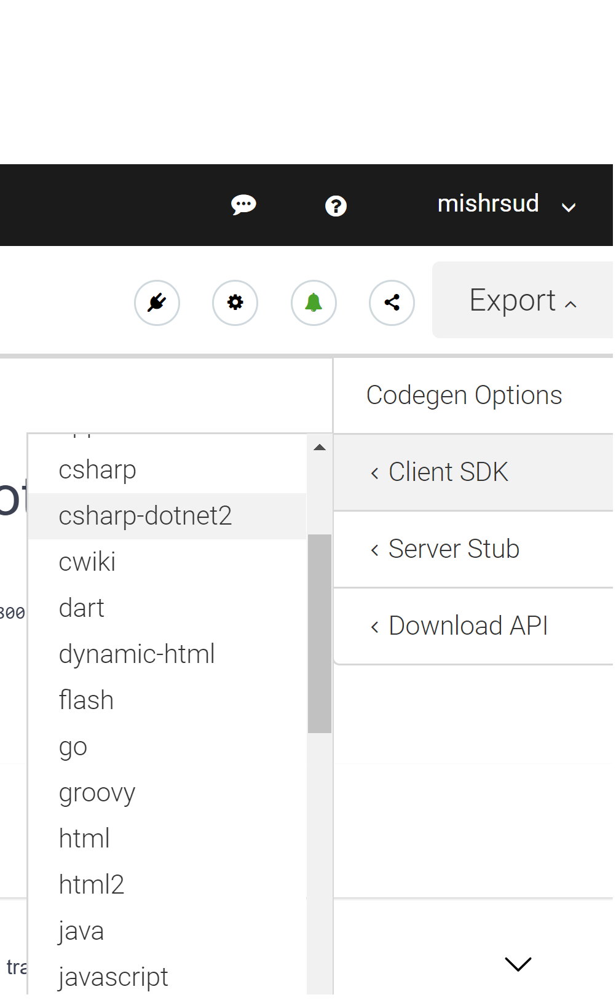

### What is this
A centralized place for the options available to generate a client that can be used to communicate with an HTTP /  REST style API.

### Problem definition
- You need to call an HTTP/REST API from C#, TypeScript or some other programming platform
- This boils down to serializing Request and Response to and from JSON, invoking the API using some sort of HTTP Client
- Hand-crafting the code to invoke the API is tedious and a good fit for code generation

### The Tools

#### When the API to call exposes an OpenAPI Spec (Swagger Doc is now OpenAPI) URL or YAML/JSON File

**Option 1: Use SwaggerHub**

1. Browse to https://swagger.io/tools/swagger-codegen/
2. Sign up (using a provider such as Github or create an account using email)
3. Go to SwaggerHUB
4. Paste the Spec in the text box 
5. Click on the Export button (top right corner) and select the platform for which client/mock needs to be generated 

**Option 2: Use NSwag Studio**
1. Get NSwag Studio from [Github](https://github.com/RSuter/NSwag)
2. In the input tab, paste the OpenAPI Spec URL or paste the spec in the text box
3. Configure parameters for generation - e.g. Scope and lifetime of HttpClient, Collection types to use etc.
4. To generate code into a file, configure a file path
5. Click generate!

Step-by-step tutorial by Nuno Caneco [here](https://medium.com/@nuno.caneco/dont-write-your-web-api-client-code-6f1dd36263b5)
