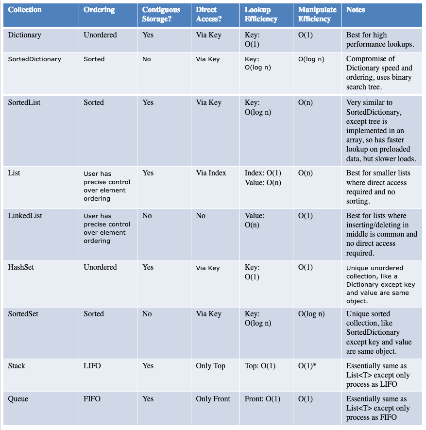

## Choosing the right collection type
- Great docs [**here**](http://geekswithblogs.net/BlackRabbitCoder/archive/2011/06/16/c.net-fundamentals-choosing-the-right-collection-class.aspx)



### Important Note
ICollection
IList
IEnumerable
ISet

Concrete Types:
Collection
List
HashSet
SortedSet

SO: Why HashSet over a List https://stackoverflow.com/a/10735440/190476

NOTE: C# HashSet mathematical equality needs to be checked using SetEquals

SO: Mathematical quality by default
```csharp
public sealed class MathSet<T> : HashSet<T>, IEquatable<MathSet<T>>
{
    public override int GetHashCode() => this.Select(elt => elt.GetHashCode()).Sum().GetHashCode();

    public bool Equals(MathSet<T> obj) => SetEquals(obj);

    public override bool Equals(object obj) => Equals(obj as MathSet<T>);

    public static bool operator ==(MathSet<T> a, MathSet<T> b) =>
        ReferenceEquals(a, null) ? ReferenceEquals(b, null) : a.Equals(b);

    public static bool operator !=(MathSet<T> a, MathSet<T> b) => !(a == b);
}
```

References
- [Code Project](https://www.codeproject.com/articles/265692/having-fun-with-custom-collections) Fun with custom collections
- [Choosing collection type](https://docs.microsoft.com/en-us/dotnet/standard/collections/selecting-a-collection-class) MS Docs
- Set based .NET collections [Code Project](https://www.codeproject.com/Articles/3190/Add-Support-for-quot-Set-quot-Collections-to-NET)
  - Related concept: Hash code and GetHashCode [Stackoverflow](https://stackoverflow.com/a/3320866/190476)
  To be stored in a hash based collection such as Hashset or Dictionary, an object needs to implement a GetHashCode method. This method is defined on the Object base class but must be customised such that the same starting value produces the same hash.