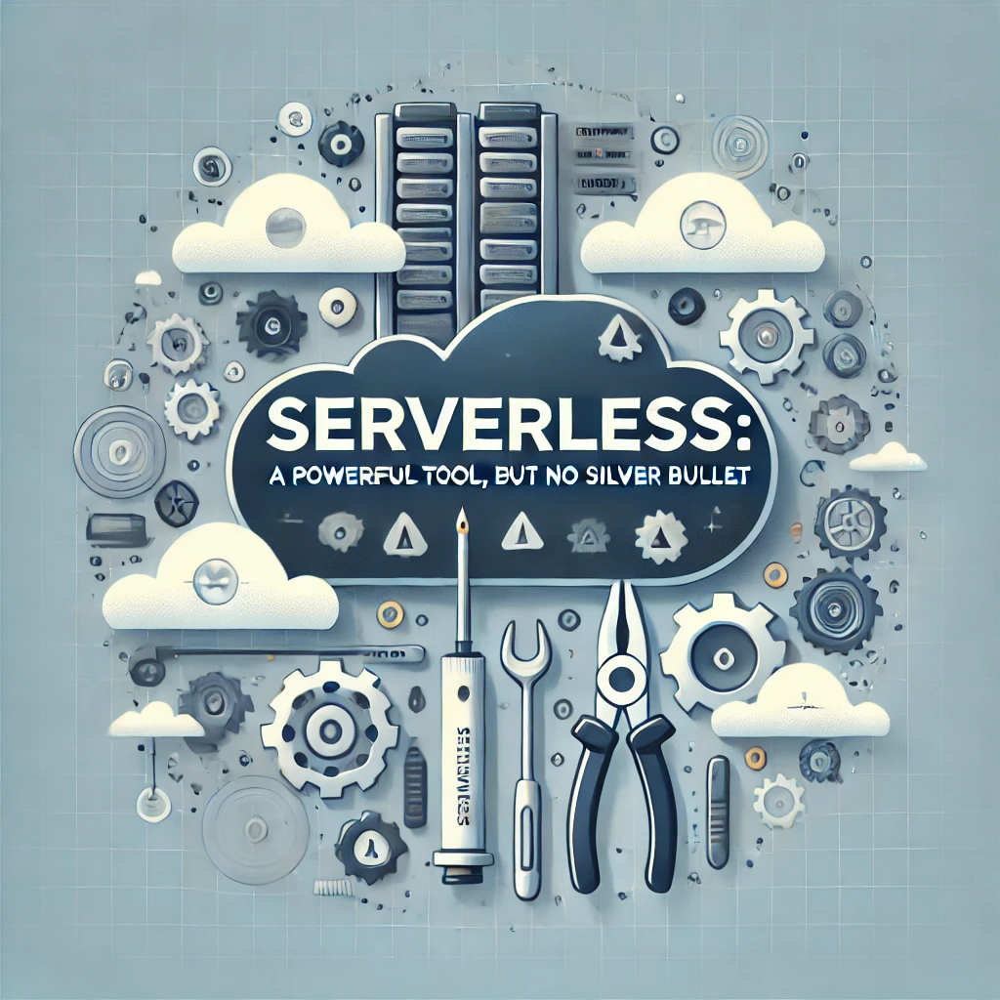
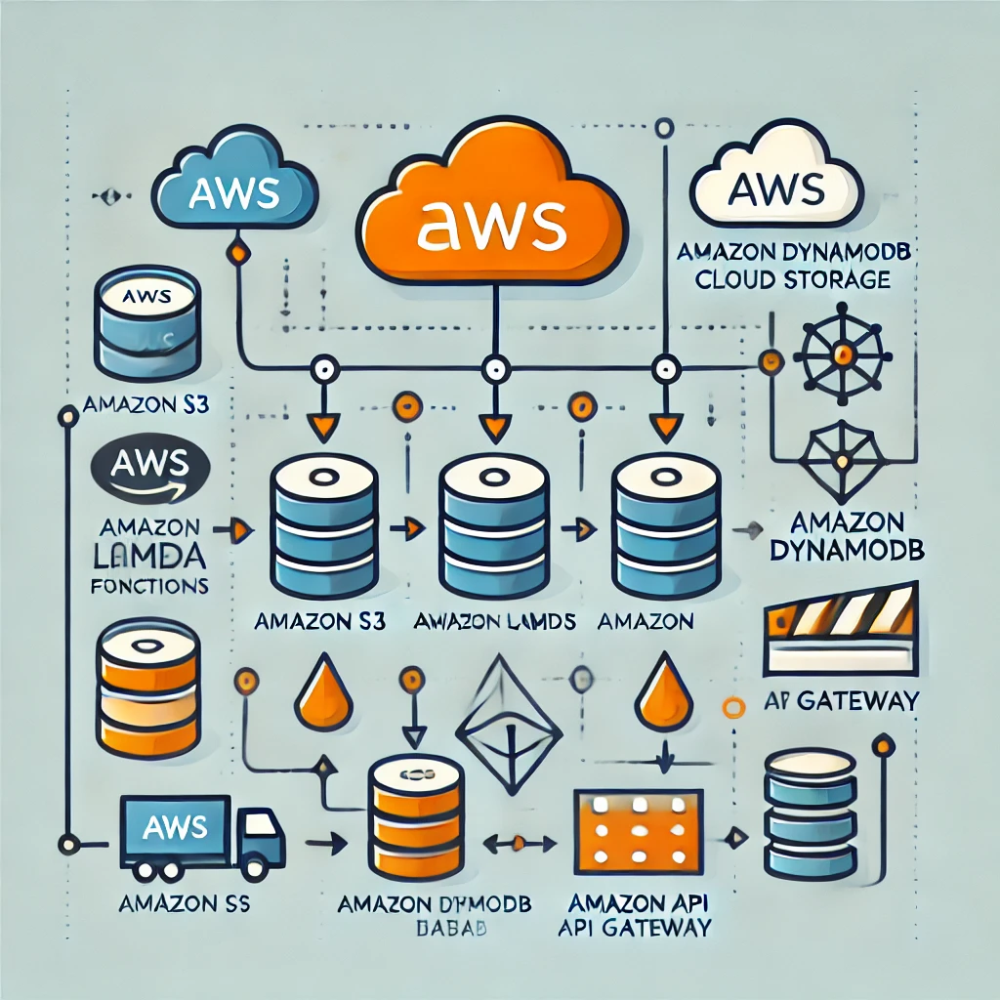

## Serverless: A Powerful Tool, But No Silver Bullet

As serverless technology has matured, it’s become an essential tool in the modern developer's toolkit. Fast to deploy, easy to scale, and adaptable, serverless promises agility and scalability, allowing developers to focus on code rather than infrastructure. Yet, like any tool, serverless comes with its own set of nuances and challenges.

Drawing from my experience and insights shared by Eric Johnson, Principal Developer Advocate at AWS, here are some practical reflections on serverless—the opportunities it provides and the caveats worth noting.

---

### 1. AWS Lambda: Simple Start, Complex Mastery

Lambda is often the gateway for developers diving into serverless. It’s incredibly easy to get started—deploying a basic function can take just a few minutes. However, building scalable, production-ready solutions requires a deeper understanding.

- **Solution Decomposition**: Decomposing applications into serverless components that are “just right” for the job takes time and experience. At first glance, it’s tempting to pack too much functionality into a single Lambda function. Over time, you learn to break down the logic into more manageable, smaller functions that are easier to monitor and troubleshoot.
- **Observability and Resiliency**: Lambda’s “infinite scale” promise sounds ideal, but in practice, it requires thoughtful design to avoid spiraling costs and ensure resilience. Implementing instrumentation and observability takes deliberate effort. Understanding Lambda’s behavior during high traffic surges—where unexpected spikes can lead to high costs or even degraded performance—requires both technical know-how and domain familiarity.
- **Cost Awareness**: The “pay-for-use” model is a double-edged sword; while it offers savings, it can become surprisingly expensive without proper cost controls and monitoring.
- **Cold Starts**: Cold starts can be a source of frustration, especially for latency-sensitive applications. Understanding how to mitigate cold starts—by optimising code, using provisioned concurrency, or other strategies is essential for maintaining consistent performance.
- **Local Development**: Developing and testing Lambda functions locally can be challenging. Tools like AWS SAM and local emulators can help, but they require a learning curve to use effectively.

### 2. Amazon SQS: Simple, but Mind the Details

Amazon Simple Queue Service (SQS) provides an excellent solution for decoupling components and handling asynchronous communication, and it’s straightforward to get up and running. However, it has its own set of nuances:

- **Delivery Guarantees**: SQS offers “at least once” delivery, meaning messages may be delivered multiple times. This requires designing applications to be idempotent, ensuring they can handle duplicate messages without unintended side effects.
- **Scalability Considerations**: SQS is built to scale, but understanding and designing around high-throughput scenarios takes practice. At scale, architectural decisions need to ensure that messages are processed efficiently, avoiding bottlenecks that can undermine performance.
- **Visibility Timeout**: The visibility timeout setting in SQS can be a source of confusion. It’s essential to understand how this setting affects message processing and how to set it correctly to avoid message loss or duplication.

### 3. Amazon Aurora: The Evolution of Serverless Databases

Amazon Aurora, particularly with its new v2 release, promises an impressive serverless database solution. Aurora v1 had some limitations that developers had to work around, especially when it came to scaling under load.

- **Scaling Challenges with Aurora v1**: With Aurora v1, scaling out was not always seamless; the database could experience timeouts before scaling, causing delays that disrupted applications. To manage this, we found that implementing robust instrumentation was key, providing insights into query performance, indexing needs, and other optimization clues.
- **Aurora v2’s Promise**: Aurora Serverless v2 aims to offer more seamless scaling, theoretically smoothing out the issues faced in v1. However, the effectiveness of this new version is yet to be proven widely in production environments. As with all new features, it’s wise to test thoroughly before relying on it for critical workloads.
- **Cost Implications**: Aurora Serverless can be cost-effective, but understanding the pricing model is crucial. The “pause and resume” feature can save costs, but it requires careful planning to avoid unexpected charges.
- **Monitoring and Optimisation**: Monitoring Aurora’s performance and optimizing queries are essential for maintaining a healthy database. Tools like Amazon RDS Performance Insights can provide valuable insights into query performance, helping to identify bottlenecks and optimize database operations.

---

### Final Thoughts: Serverless Isn’t a “Set It and Forget It” Solution

Serverless is a powerful tool for modern development, and when used correctly, it enables quick, scalable, and cost-effective deployments. But, as Eric Johnson emphasizes, it’s not a “set it and forget it” solution. The learning curve for things like debugging distributed systems, handling costs, and ensuring application resilience can be steep.

The takeaway here? Serverless is a valuable addition to your toolkit, but like any tool, it requires skill and a deep understanding of its mechanics. Invest the time in understanding the architecture, monitoring solutions, and cost implications—because, while serverless accelerates your ability to go to market, it also demands respect for its limitations.

## References

- [What’s Next for Serverless? | Eric Johnson, Principal Developer at AWS | ServerlessDaysBLR 2024 - YouTube](https://www.youtube.com/watch?v=r6D9AHNpZXg)
- [AWS Lambda - Serverless Compute - Amazon Web Services](https://aws.amazon.com/lambda/)
- [Amazon SQS - Managed Message Queues - Amazon Web Services](https://aws.amazon.com/sqs/)
- [Amazon Aurora - Relational Database Built for the Cloud - Amazon Web Services](https://aws.amazon.com/rds/aurora/)
