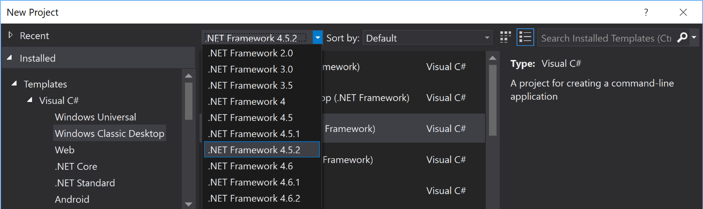

Title: Targeting .NET 4.7 from Visual Studio 2017 
Lead: Developer tools have a way of stumping you in the most unexpected of ways. This post analyses and then illustrates how to get VS 2017 list .NET 4.7 as a target framework for your projects, minus the pain. 
Published: 7/25/2017
Tags:
  - .NET 
  - .NET-47 
  - VS2017 
  - Visual-Studio
  - Dev-Tools
---

---

# Prologue

So, one fine Tuesday morning I wanted to take .NET 4.7 for a spin and like anyone launched my favourite editor Visual Studio 2017, Professional (disclaimer: favourite for the purpose) and (no surprises here) went File -> New Project. Much to my chagrin, .NET 4.7 wasn't listed as a target framework. 

I did the next obvious thing i.e. clicked the "More Frameworks" link and landed on a nice looking "Targeting .NET Platforms" page. If you thought that was it, apologies because herein starts our mini-adventure - triggered in parts due to a curious yours truly.
(As an aside, the mentioned page looks very much like the new ASP.NET default template!)

# What do we know? What have we learnt?

Some very smart and respected people say [lazy people make good developers](https://blog.codinghorror.com/how-to-be-lazy-dumb-and-successful/). I'm one of those.. er.. lazy people (today isn't a day to be presumptuous and call myself smart!). When I need to install something, I usually try to find the quickest (read scripted) way of getting it done. In the Windows ecosystem, [Chocolatey](https://chocolatey.org/) has been the go to scripting or package management solution for some time now. Look up that link if you haven't heard of chocolatey before - it is a great way of managing your Windows PC. Once you have chocolatey installed, you can simply execute a command like the following to install a package:

```
# Search for a package, lists all packages from officila repo
choco search foo

# foo is the name of the package you want to install
choco install foo 

# note that some packages may require that you run the above comand from an admin (aka elevated) command prompt.
```

# Attempt 1 (of n): Find a chocolatey script to do it for you
I tried looking up for a choco package that would get the job done like so:

```
choco search dotnet4.7

# prints the following as of this writing:
# Chocolatey v0.10.5
# dotnet4.7 4.7.2053.0 [Approved] Downloads cached for licensed users
# 1 packages found.
```
Next, I launched the install command to install the package like so:

```
choco install dotnet4.7
```
After accepting that the package would run script blah and that I implicitly agree to the license terms of the package authors, choco said that it installed the package successfully. To check, I ran a little powershell script and it reported that .NET 4.7 was indeed installed. 
Here's the script:
<script src="https://gist.github.com/mishrsud/634b9abc11644b49d83efe65dd044596.js"></script>

All good? Well, Not so fast! Visual studio still did not offer .NET 4.7 as a target framework!

# Attempt 2 (of n): DuckDuck go foo (or Google if you want to be tracked)

Next, I tried to modify the choco package search to see if there's another package that needs to be installed. That search looked like so:

```
choco search 4.7

# prints the following as of this writing:
# Chocolatey v0.10.5                                                            
# dotnet4.7 4.7.2053.0 [Approved] Downloads cached for licensed users           
# netfx-4.7-devpack 4.7.2053.0 [Approved] Downloads cached for licensed users   
# KB4019990 1.0.0 [Approved]                                                    
# 3 packages found.                                                             
```

Did you notice the pesky netfx-4.7-devpack? What's that? Let's find out! 
A little DuckDuck-going (ew! that still does not sound as good as googling, but I don't want to be tracked. Period.) landed me on the following [MS Support Article](https://support.microsoft.com/en-us/help/3186612/the-net-framework-4-7-developer-pack-and-language-packs)

The TL;DR; from that article is: 
>The .NET Framework 4.7 Developer Pack lets developers build applications that target the .NET Framework 4.7 by using Visual Studio 2015, or third-party IDEs. This is a single package that bundles the .NET Framework 4.7, the .NET 4.7 Targeting Pack, and the .NET Framework 4.7 SDK. The associated language packs for Developer Pack contain the language-specific resources for the .NET Framework 4.7 and the .NET Framework 4.7 SDK.

Right, so looks like what I installed in my first attempt was just the runtime for .NET 4.7 and not the tooling to let me target a project to .NET 4.7. As a sidenote, the developer pack isn't the same as an SDK as [this stackoverflow thread explains](https://stackoverflow.com/a/29303714/190476). The explanation holds for .NET 4.7.

# .NET Framework Target packs, Reference Assemblies, Multi Targeting packs and more

As it turns out, Microsoft teams adopted the strategy of distributing packages such that making newer framework iterations available wasn't dependent on Windows Update cadence. Hence, a particular framework comes with the following possible packs:
- The framework itself: These are the assemblies that are part of a particular version of the framework
- A targeting pack: These are "reference assemblies" that the compiler uses to analyse and parse code written for a particular framework version. This [blog from BCL Team](https://blogs.msdn.microsoft.com/bclteam/2012/04/11/multi-targeting-guidelines-for-tools-for-managed-code-mircea/) describes in detail the core concepts behind the targeting packs. For completeness, here's the most relevant section:
 >A multi-targeting pack, or MT pack, is a set of reference assemblies that corresponds to a particular .NET Framework platform and version. A reference assembly is a .NET Framework assembly that typically has no method bodies and no internal or private APIs. Reference assemblies contain just the information a compiler needs.
- A language pack: The language pack provides localization for other supported languages for things like intellisense, inline help etc.
- An SDK: This consists of documentation, header files, libraries, samples and tools required to develop applications for a specific version of .NET framework on a supported platform (e.g. Windows 10)

Now, to see how a reference assembly defers from a usual one, one can use a tool like dotPeek from JetBrains to take a look. 

This is how a reference assembly looks in the dotPeek decompiler: (notice how there's only metadata and references)


Compare it to an assembly like we know:


## Quick Reference:

```
#install this on a machine where you need to develop apps using an IDE
choco install netfx-4.7-devpack

#install this on a client machine that only needs to run an application built on .NET 4.7
choco install dotnet4.7
```